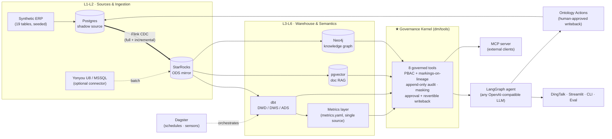

# DataSteward

**English** | [中文](README.zh-CN.md)

> An open-source, self-hosted reference implementation of a **Foundry-style governed data platform** — AI-agent native.
>
> **Agents don't get a database connection. They get governed tools.**

[](LICENSE)
[](https://github.com/Leonxu6/datasteward/actions/workflows/ci.yml)
[](pyproject.toml)

DataSteward is a complete, runnable answer to one question: **what does it take to let an LLM agent touch enterprise data responsibly?**

Every query the agent makes passes through a **governance kernel**: an ontology that defines what the data *means*, purpose-based access control with **markings that propagate along lineage**, a **full append-only audit trail** of who saw what and why, and **writebacks that require human approval and can be rolled back**. Underneath sits a real ten-layer data stack — CDC ingestion, warehouse, dbt modeling, a metrics layer, orchestration — all containerized, all runnable on a 16GB laptop.

## Why

**Text-to-SQL is the easy part.** Tools like Vanna or DB-GPT generate SQL from natural language, but they hand the agent a raw database connection. They have no answer for the questions that actually block production adoption: *Should this role see this column? Who approved this write? Can we undo it? What exactly did the agent look at last Tuesday?*

**Palantir Foundry answered those questions** — with its ontology, markings, audit, and Actions — but it is closed-source and priced for governments and Fortune 500s.

**DataSteward is a minimal but complete open-source reference implementation of that governance shape**, with an AI agent as a first-class, governed citizen. It ships with a fictional manufacturing-ERP demo dataset (19 tables, deterministic, eval-ready) so every governance behavior is reproducible on your machine.

## Architecture



The agent (and any external MCP client) can only reach data through the kernel — the same PBAC checks, audit fields, and error messages on both paths, implemented exactly once.

### Ten layers → directories

| Layer | What | Where |
|---|---|---|
| L1 Connectors | Postgres / SQL Server (Yonyou U8) / file sources, credential isolation | `src/dm/connect/` |
| L2 Ingestion | Flink CDC (19-table mirror) + U8 batch extraction with watermarks | `src/dm/pipeline/`, `infra/` |
| L3 Warehouse | StarRocks (MySQL protocol), read-only to all consumers | `src/dm/warehouse/` |
| L4-L5 Modeling | dbt: ODS → DWD (star) → DWS → ADS + tests as quality gates | `transform/dbt/` |
| L6 Metrics | `metrics.yaml` + compiler — one definition for agent, reports, eval | `src/dm/ontology/metrics.yaml` |
| L7 Orchestration | Dagster: 43 assets, schedules, health-alert sensor | `src/dm/orchestration/` |
| L8 Channels | DingTalk (optional) / Streamlit / CLI — one shared session-trace contract | `src/dm/channels/`, `src/dm/app/` |
| L9 Governance surfaces | Catalog, lineage (+markings propagation), health, audit replay | `src/dm/app/pages/`, `src/dm/health/` |
| L10 Agent | Self-built LangGraph ReAct loop, PG checkpoints, in-process kernel calls | `src/dm/agent/` |
| ★ Kernel | Ontology / security / audit / actions — the part everything must pass through | `src/dm/tools/`, `src/dm/security/`, `src/dm/ontology/` |

Unstructured docs (pgvector RAG) and a Neo4j knowledge graph hang off the same kernel via `search_documents` / `graph_query`.

## Quickstart (~30 min)

Prereqs: Docker (compose v2), 16GB RAM, and **either** an OpenAI-compatible API key (zero GPU needed) **or** `--profile ollama` for a fully local model.

```bash
git clone https://github.com/Leonxu6/datasteward && cd datasteward
cp .env.example .env          # fill DM_LLM_API_KEY (or switch to the ollama block)
bash deploy/quickstart.sh     # infra → seed → CDC → dbt → app  (Windows: run in Git Bash / WSL)
```

Then ask the agent its first question:

```bash
docker compose -f deploy/docker-compose.yml run --rm dm-cli \
  dm-agent "物料 M0001 现在总库存多少？"     # "What's the current total stock of material M0001?"
# → the agent plans, calls governed tools, and answers: 12 (deterministic demo data)
```

Open the governance console at `http://localhost:8501` and Dagster at `http://localhost:3070`.

> The demo dataset is Chinese-language manufacturing ERP data (the agent answers in Chinese). An English demo dataset is on the roadmap.

## Governance in action — four adversarial demos

These are the behaviors that distinguish a governed platform from a chatbot with a DB connection. All four are reproducible right after quickstart.

**1. Permission denied — markings block a column, before the DB is ever touched**

```bash
docker compose -f deploy/docker-compose.yml run --rm dm-cli python -c "
from dm.tools import Principal, run_sql
print(run_sql(Principal(user='demo', role='仓管'), 'SELECT customer_id, credit_limit FROM customer LIMIT 3'))"
```

The `仓管` (warehouse keeper) role lacks the `FIN` marking that covers `customer.credit_limit` → the kernel refuses with an explicit reason, and writes an `UNAUTHORIZED` audit record. Ask the same through the agent and it will tell you the data is permission-protected — instead of hallucinating a number.

**2. Full audit — who, what, why, result, for every single tool call**

```bash
tail -3 data/logs/audit_log.jsonl
```

Every kernel call (agent or MCP) appends one JSON line: user, role, purpose, tool, SQL, tables touched, row counts, decision. The Streamlit "访问治理" page replays any session's full task chain by `session_id`.

**3. Writeback needs a human — execute is a preview until someone approves**

```bash
docker compose -f deploy/docker-compose.yml run --rm dm-cli python -c "
from dm.ontology.actions import execute_action, approve_action, pending_actions
from dm.security import User
r = execute_action('adjust_safety_stock', {'material_id':'M0001','new_value':20},
                   user=User(name='alice', role='采购'))
print('pending:', r)
print(approve_action(r['action_id'], user=User(name='boss', role='管理层')))"
```

`execute_action` with the default `approve=False` only validates + records a pending action — nothing is written. Approval executes it **against the Postgres source** (never the warehouse), and Flink CDC flows the change back into StarRocks. Try it with `role='仓管'` and watch the write-permission gate (independent of read permissions) reject it.

**4. Rollback — every executed action can be reverted, with provenance**

```bash
docker compose -f deploy/docker-compose.yml run --rm dm-cli python -c "
from dm.ontology.actions import action_history, rollback_action
from dm.security import User
aid = [a for a in action_history() if a['status']=='executed'][-1]['action_id']
print(rollback_action(aid, user=User(name='boss', role='管理层')))"
```

The prior value was recorded at execution time; rollback restores it and leaves an audit trail of both the do and the undo.

## The governance kernel

Eight tools, one implementation, two consumers (in-process agent + stdio MCP for external clients):

| Tool | Kind | Governance applied |
|---|---|---|
| `list_tables` / `describe_table` | read | catalog scoped by role |
| `run_sql` | read | SQL guard (SELECT-only) → PBAC + column markings + row policies + masking → audit |
| `query_metric` / `list_metrics` | read | metric definitions compiled from `metrics.yaml` — the agent cannot invent a caliber |
| `search_documents` | read | pgvector RAG with entity-aware reranking |
| `graph_query` | read | Neo4j multi-hop impact/tracing |
| `execute_action` | **write** | write permission (independent of read) → precondition checks → human approval → revertible → CDC round-trip |

Every call takes an explicit `Principal` (user, role, purpose, session, channel) — no ambient authority. Markings (`PII`, `FIN`, `U8`) attach to columns and sources and **propagate down the dbt lineage** to derived tables.

## Eval, not vibes

`dm-eval` runs a YAML eval set (`src/dm/eval/eval_set.yaml`) with four grader types: numeric (against SQL ground truth computed live from the warehouse), set, refusal (out-of-scope questions must be refused, not hallucinated), and LLM-judge for narratives. New features are expected to land with new eval cases.

## The demo dataset

A fictional manufacturing company ("云帆智能装备" — all names are invented; any resemblance is coincidental): 19 ERP tables (materials, inventory, purchase/sales orders, production, suppliers…), generated deterministically with `SEED=42` and a frozen data anchor `TODAY=2026-06-25` — so eval ground truths are stable and every demo above reproduces exactly. An optional Yonyou U8 simulation source (`--profile sim-u8`, x86 only) demonstrates the real-ERP batch-extraction path with incremental watermarks.

## Stack & profiles

| Profile | Services | Memory (approx.) |
|---|---|---|
| *(default)* | StarRocks allin1 · Postgres (pgvector) · Flink JM+TM · Neo4j | ~9 GB |
| `app` | Streamlit console :8501 · Dagster web+daemon :3070 | +2.5 GB |
| `tools` | `dm-cli` one-shot task runner | — |
| `ollama` | Local LLM (default pulls `qwen3:8b`, ~5 GB) | +6 GB / GPU |
| `dingtalk` | DingTalk two-way stream bot (needs app credentials) | +0.5 GB |
| `sim-u8` | Yonyou U8 simulation (azure-sql-edge, **x86 only**) | +2 GB |
| `om` | OpenMetadata (heavyweight, optional) | +6 GB |

All host ports remap via `DM_PORT_*` in `.env`. Multi-arch: runs on amd64 and arm64 (the production reference deployment is an aarch64 box).

## Roadmap

- Real-time SQL Server CDC (U8 path is currently batch + watermark)
- Multi-agent supervisor on top of the governance kernel
- Semantic layer as a service (metrics API)
- Langfuse tracing; column-level lineage everywhere
- English demo dataset & English deep docs

## Docs

Deep docs are currently **Chinese-first** (translations welcome — see [CONTRIBUTING.md](CONTRIBUTING.md)):

- [`docs/design/`](docs/design/) — 12 design docs studying the Foundry governance model and mapping it onto this stack (ontology, markings, audit, lineage, actions, health…), plus an implementation-grade [SPEC](docs/design/SPEC.md)
- [`docs/PLAN.md`](docs/PLAN.md) — design & acceptance criteria, v1 (PoC) → v2 (ten-layer production)
- [`docs/DEVLOG.md`](docs/DEVLOG.md) — 29 hard-won pitfalls with root causes and fixes (StarRocks networking, CDC, ollama tool-calling, LLM cancellation black holes…)

*Palantir and Foundry are trademarks of Palantir Technologies. This independent project is not affiliated with or endorsed by Palantir; it references only publicly documented concepts as a design benchmark.*

## Contributing & License

PRs welcome — see [CONTRIBUTING.md](CONTRIBUTING.md) (unit tests run on a bare machine; the stack tier auto-skips when services are absent).

Apache-2.0 © DataSteward contributors
