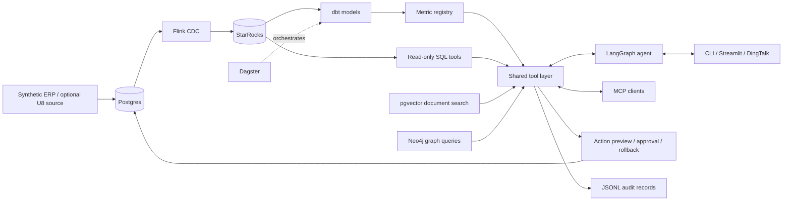

# DataSteward

**English** | [中文](README.zh-CN.md)

**A self-hosted data platform for exploring governed AI access to manufacturing data.**

[](LICENSE)
[](https://github.com/Leonxu6/datasteward/actions/workflows/ci.yml)
[](pyproject.toml)

DataSteward connects an ERP-style data pipeline to a LangGraph agent through a shared tool layer. The engineering question is practical: **how should an agent query business data, explain its access, and propose changes that can be reviewed and reversed?**

The repository brings together Postgres → Flink CDC → StarRocks, dbt models, a metric registry, access policies, audit records, and source-system writebacks. A fictional Chinese-language manufacturing dataset makes the workflow inspectable without customer data. This is a reference implementation for local development and experimentation; the [trust boundaries](#scope-and-trust-boundaries) below describe what it does and does not enforce.

## Product workflow

The demo is designed around manufacturing operations: a warehouse user checks inventory, a buyer proposes a safety-stock adjustment, and a manager reviews the change. The console brings the underlying data, policy decision, and session trace together so a reviewer can follow how an answer or proposed action was produced.

**Demo path:** ask about stock → inspect the query and access decision → preview a supported action → approve it in the demo workflow → inspect the source change and audit record. This demonstrates a product workflow with synthetic data; it is not evidence of customer adoption or business impact.

## Engineering focus

| Design choice | Why it matters | Start reading |
|---|---|---|
| Shared tools for LangGraph and MCP | Keeps tool behavior in one implementation instead of duplicating it across clients | [Tool kernel](src/dm/tools/), [agent adapter](src/dm/agent/graph.py), [MCP adapter](src/dm/connector/mcp_server.py) |
| Explicit caller context | Carries user, role, purpose, session, channel, and warehouse scope into query policy checks and audit records | [Principal](src/dm/tools/principal.py), [policy engine](src/dm/security/policy.py) |
| SQL and metric access controls | Applies read-only SQL validation, markings, row policies, and masking; metrics are compiled from named definitions | [SQL tools](src/dm/tools/data.py), [metric registry](src/dm/ontology/metrics.yaml) |
| Write to the source, then replicate | Keeps operational changes in Postgres and uses CDC to update the analytical view | [Actions](src/dm/ontology/actions.py), [CDC generation](src/dm/pipeline/gen_flink_cdc_sql.py) |
| Deterministic fixtures and layered tests | Separates local contract checks from database integration and LLM evaluation | [Data generator](src/dm/warehouse/generate.py), [tests](tests/), [eval cases](src/dm/eval/eval_set.yaml) |

## Architecture


```mermaid
flowchart LR
    ERP["Synthetic ERP / optional U8 source"] --> PG[(Postgres)]
    PG --> CDC["Flink CDC"] --> SR[(StarRocks)]
    SR --> DBT["dbt models"] --> MET["Metric registry"]
    SR --> SQL["Read-only SQL tools"]
    MET --> K["Shared tool layer"]
    SQL --> K
    RAG["pgvector document search"] --> K
    KG["Neo4j graph queries"] --> K
    K <--> AGENT["LangGraph agent"]
    K <--> MCP["MCP clients"]
    AGENT <--> UI["CLI / Streamlit / DingTalk"]
    K --> ACT["Action preview / approval / rollback"] --> PG
    K --> AUDIT["JSONL audit records"]
    DAG["Dagster"] -. orchestrates .-> DBT
```

The agent's tool definitions delegate to `dm.tools`; database credentials remain in the application runtime. SQL queries and metrics use policy checks. Document and graph tools share the identity/audit plumbing, but do not implement equivalent per-document or per-entity authorization.

The repository also includes a Streamlit console for catalog, lineage, health, and session replay; Dagster schedules and sensors; and optional SQL Server/U8 and DingTalk integrations. The [design specification](docs/design/SPEC.md) explains the broader layer structure.

## Run the demo

You need Docker with Compose v2 and enough resources for several database and processing services. Agent questions require an OpenAI-compatible endpoint with tool-calling support; the data pipeline can run without an LLM. Resource use and first-run download time depend on enabled profiles and model choice.

```bash
git clone https://github.com/Leonxu6/datasteward
cd datasteward
cp .env.example .env
# Configure the endpoint, model, and DM_LLM_API_KEY in .env.
bash deploy/quickstart.sh
```

Use Git Bash or WSL on Windows. See [configuration](docs/operations/configuration.md) and [deployment](docs/operations/deployment.md) for settings and optional services. For document indexing and a graph skeleton, use `bash deploy/quickstart.sh --with-docs`. Ollama is an optional Compose profile; configure its endpoint using the comments in `.env.example`.

Default interfaces: Streamlit at `http://localhost:8501`, Dagster at `http://localhost:3070`. Host ports can be changed with `DM_PORT_*` settings.

```bash
docker compose -f deploy/docker-compose.yml run --rm dm-cli \
  dm-agent "物料 M0001 现在总库存多少？"
```

The seeded fixture gives material `M0001` a total stock of **12**. This is an expected demo result, not an accuracy benchmark; the model's response still needs to be checked. The generator uses `SEED=42` and a fixed `2026-06-25` data anchor across 19 business tables.

The quickstart script can continue after CDC submission or smoke-check failures. Inspect its output and run `bash deploy/smoke.sh` separately before treating the stack as ready.

## Follow a request through the system

**1. Inspect a denied query.** After setup, this warehouse-role query requests a finance-marked column:

```bash
docker compose -f deploy/docker-compose.yml run --rm dm-cli python -c "
from dm.tools import Principal, run_sql
print(run_sql(Principal(user='demo', role='仓管'),
              'SELECT customer_id, credit_limit FROM customer LIMIT 3'))"
```

`run_sql` checks the query before execution. The policy denies the requested finance data and attempts to record the decision in the audit log. The [kernel tests](tests/test_tools_kernel.py) and [policy boundary tests](tests/test_security_policy_boundaries.py) are useful entry points for inspecting this behavior.

**2. Inspect the trace.** Tool records include caller context, arguments, timing, and result metadata. The console's governance page groups activity by `session_id`.

```bash
tail -3 data/logs/audit_log.jsonl
```

**3. Review the writeback lifecycle.** `execute_action` defaults to a pending preview; `approve_action` executes the recorded proposal; `rollback_action` uses recorded values to reverse supported changes. Writes target Postgres, then reach StarRocks through CDC. Review [the implementation](src/dm/ontology/actions.py), [approval-state tests](tests/test_action_approval_state.py), and [integer validation tests](tests/test_action_integer_contract.py). These examples change local demo data when approved.

## Verification

For a local development environment matching the unit-test CI job:

```bash
python -m venv .venv
. .venv/bin/activate
python -m pip install -e '.[dev,rag,kg,agent]'
pytest -m "not integration and not stack" -q
python -m scripts.run_maintenance_audits
```

The [CI workflow](.github/workflows/ci.yml) also checks dbt parsing and Compose configuration. Database-backed tests use the `stack` marker and skip when services are unavailable; `integration` tests need additional external dependencies. A skipped test is not evidence that an integration works. See [CONTRIBUTING.md](CONTRIBUTING.md) for the complete development workflow.

For a running stack and configured model:

```bash
docker compose -f deploy/docker-compose.yml run --rm dm-cli dm-eval
```

The evaluation runner supports numeric, set, refusal, and narrative grading. Numeric cases compare against SQL ground truth from the running warehouse; narrative grading can use an LLM judge. Results depend on the dataset, endpoint, and model configuration. No aggregate performance claim is made here.

## Scope and trust boundaries

- **Identity is supplied by the host application.** `Principal` validates fields; it does not authenticate a person. The MCP path reads identity from environment settings. Deployments need a trusted identity and role-assignment boundary.
- **Approval is a workflow, not independent human authentication.** The action API exposes an `approve` flag to authorized callers. An enforced human-only approval step requires an additional trusted boundary; the current interface alone does not guarantee it.
- **Audit storage is local JSONL, with best-effort paths.** Some completed operations return an `audit_warning` if persistence fails. Logs are not a tamper-evident compliance ledger, and not every audit failure is surfaced to the caller.
- **Authorization coverage varies by tool.** SQL/metric policy checks do not imply equivalent filtering for catalog metadata, document search, or graph results. Review each tool before connecting sensitive data.
- **This is a single-machine reference stack.** It does not establish high availability, independent security certification, or production performance. The U8 path uses batch extraction with watermarks; the optional simulator is x86-only.

These boundaries are also concrete areas for further work: authenticated approval separation, consistent retrieval authorization, durable audit delivery, and integration evidence across deployment profiles.

## Documentation

Deep documentation is currently Chinese-first:

- [Design studies](docs/design/) and [implementation specification](docs/design/SPEC.md) — ontology, markings, lineage, actions, and platform design.
- [Project plan](docs/PLAN.md) — design goals and acceptance criteria; planned work is not a release guarantee.
- [Development log](docs/DEVLOG.md) — implementation notes on CDC, container networking, model tool calling, and cancellation behavior.
- [Operations](docs/operations/) — configuration, security, connectors, deployment, and troubleshooting.
- [Contributing](CONTRIBUTING.md) — development setup, test tiers, and data contracts.

Some design documents study publicly documented Palantir Foundry concepts. DataSteward is an independent project, with no affiliation or endorsement; those references do not imply feature parity.

## License

[Apache-2.0](LICENSE).
