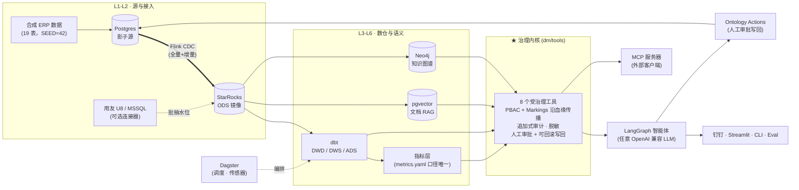

# DataSteward（数据管家）

[English](README.md) | **中文**

> 开源、可自托管的 **Foundry 式治理数据平台**参考实现——AI Agent 原生。
>
> **智能体拿不到数据库连接，只能拿到受治理的工具。**

[](LICENSE)
[](https://github.com/Leonxu6/datasteward/actions/workflows/ci.yml)
[](pyproject.toml)

DataSteward 完整地回答一个问题：**让 LLM 智能体负责任地触碰企业数据，到底需要什么？**

智能体的每一次取数都必须穿过一个**治理内核**：本体层定义数据的业务语义；PBAC（基于目的的访问控制）+ **沿血缘传播的 Markings** 决定"该不该看"；**追加式全量审计**记下谁在什么时候、为什么、看了什么；**写回必须人工审批、且可回滚**。内核之下是一套真实的十层数据栈——CDC 接入、数仓、dbt 建模、指标层、编排——全容器化，16GB 笔记本可跑。

## 为什么做这个

**Text-to-SQL 是最容易的部分。** Vanna、DB-GPT 这类工具能把自然语言变成 SQL，但它们把裸数据库连接直接交给智能体。真正卡住生产落地的问题，它们一个都不回答：*这个角色该看这一列吗？这次写回谁批准的？能撤销吗？智能体上周二到底看了什么？*

**Palantir Foundry 回答了这些问题**——本体、Markings、审计、Actions——但它闭源，且定价面向政府和世界五百强。

**DataSteward 是这套治理形态的最小完整开源参考实现**，并且把 AI 智能体作为一等公民纳入治理。内置一套虚构制造业 ERP 演示数据集（19 张表、确定性生成、eval 就绪），上面的每一个治理行为都能在你自己机器上复现。

## 架构



智能体（以及任何外部 MCP 客户端）只能经内核取数——两条路径的权限判定、审计字段、报错文案完全一致，治理逻辑只实现一份。

### 十层 → 目录映射

| 层 | 内容 | 位置 |
|---|---|---|
| L1 连接器 | Postgres / SQL Server(用友 U8) / 文件源，凭据隔离 | `src/dm/connect/` |
| L2 接入 | Flink CDC（19 表镜像）+ U8 批抽增量水位 | `src/dm/pipeline/`、`infra/` |
| L3 数仓 | StarRocks（MySQL 协议），对所有消费方只读 | `src/dm/warehouse/` |
| L4-L5 建模 | dbt：ODS → DWD(星型) → DWS → ADS + tests 质量门禁 | `transform/dbt/` |
| L6 指标 | `metrics.yaml` + 编译器——智能体/报表/eval 同一口径 | `src/dm/ontology/metrics.yaml` |
| L7 编排 | Dagster：43 资产、调度、健康告警 sensor | `src/dm/orchestration/` |
| L8 通道 | 钉钉(可选) / Streamlit / CLI——共用一条会话留痕契约 | `src/dm/channels/`、`src/dm/app/` |
| L9 治理界面 | 数据目录、血缘(+Marking 传播)、健康、审计回放 | `src/dm/app/pages/`、`src/dm/health/` |
| L10 智能体 | 自研 LangGraph ReAct 循环、PG 检查点、进程内直调内核 | `src/dm/agent/` |
| ★ 内核 | 本体 / 安全 / 审计 / Actions——一切必须穿过的部分 | `src/dm/tools/`、`src/dm/security/`、`src/dm/ontology/` |

非结构化文档（pgvector RAG）与 Neo4j 知识图谱经同一内核的 `search_documents` / `graph_query` 提供。

## 快速开始（约 30 分钟）

前置：Docker（compose v2）、16GB 内存，以及**二选一**——任意 OpenAI 兼容 API key（DeepSeek/OpenAI/Moonshot 等，零 GPU），或 `--profile ollama` 全本地模型。

```bash
git clone https://github.com/Leonxu6/datasteward && cd datasteward
cp .env.example .env          # 填 DM_LLM_API_KEY（或按注释切换到 ollama 方案）
bash deploy/quickstart.sh     # 基建 → 灌数 → CDC → dbt → 应用层（Windows 在 Git Bash/WSL 里跑）
```

问智能体第一个问题：

```bash
docker compose -f deploy/docker-compose.yml run --rm dm-cli \
  dm-agent "物料 M0001 现在总库存多少？"
# → 智能体自主规划、调用受治理工具、作答：12（确定性演示数据）
```

治理台 `http://localhost:8501`，Dagster `http://localhost:3070`。

## 治理实战——四个对抗例

这四个行为是"治理平台"与"接了数据库的聊天机器人"的分界线，quickstart 之后即可复现。

**1. 权限拒绝——Markings 在碰到数据库之前就拦下这一列**

```bash
docker compose -f deploy/docker-compose.yml run --rm dm-cli python -c "
from dm.tools import Principal, run_sql
print(run_sql(Principal(user='demo', role='仓管'), 'SELECT customer_id, credit_limit FROM customer LIMIT 3'))"
```

`仓管`角色没有覆盖 `customer.credit_limit` 的 `FIN` Marking → 内核拒绝并给出明确理由，同时写一条 `UNAUTHORIZED` 审计。经智能体问同样的问题，它会如实告知"受权限保护"——而不是编一个数字。

**2. 全量审计——每一次工具调用的 who / what / why / result**

```bash
tail -3 data/logs/audit_log.jsonl
```

内核的每次调用（无论来自智能体还是 MCP）追加一行 JSON：用户、角色、目的、工具、SQL、命中表、返回行数、判定。Streamlit「访问治理」页可按 `session_id` 回放任一会话的完整任务链。

**3. 写回必须有人审批——execute 只是预览，approve 才落库**

```bash
docker compose -f deploy/docker-compose.yml run --rm dm-cli python -c "
from dm.ontology.actions import execute_action, approve_action, pending_actions
from dm.security import User
r = execute_action('adjust_safety_stock', {'material_id':'M0001','new_value':20},
                   user=User(name='alice', role='采购'))
print('pending:', r)
print(approve_action(r['action_id'], user=User(name='boss', role='管理层')))"
```

`execute_action` 默认 `approve=False`：只校验提交条件、记 pending，**不写任何库**。审批后写入 **Postgres 源库**（绝不直写数仓），再由 Flink CDC 回流 StarRocks。把角色换成 `仓管` 试试——写回权限（独立于读权限）会当场拒绝。

**4. 可回滚——每个已执行的 Action 都能撤销，且留痕**

```bash
docker compose -f deploy/docker-compose.yml run --rm dm-cli python -c "
from dm.ontology.actions import action_history, rollback_action
from dm.security import User
aid = [a for a in action_history() if a['status']=='executed'][-1]['action_id']
print(rollback_action(aid, user=User(name='boss', role='管理层')))"
```

执行时已记录旧值；回滚恢复旧值，并且"做"与"撤"都在审计里。

## 治理内核

8 个工具，一份实现，两个消费方（进程内智能体 + 对外 stdio MCP）：

| 工具 | 类型 | 施加的治理 |
|---|---|---|
| `list_tables` / `describe_table` | 读 | 按角色收窄的目录 |
| `run_sql` | 读 | SQL 卫兵（仅 SELECT）→ PBAC + 列级 Markings + 行级策略 + 脱敏 → 审计 |
| `query_metric` / `list_metrics` | 读 | 口径从 `metrics.yaml` 编译——智能体无法自造口径 |
| `search_documents` | 读 | pgvector RAG + 实体感知重排 |
| `graph_query` | 读 | Neo4j 多跳影响/溯源 |
| `execute_action` | **写** | 写回权限（独立于读）→ 提交条件 → 人工审批 → 可回滚 → CDC 回流 |

每次调用显式传 `Principal`（用户、角色、目的、会话、通道）——没有隐式权限。Markings（`PII`/`FIN`/`U8`）打在列与源上，并**沿 dbt 血缘向下游派生表传播**。

## Eval 驱动，拒绝"感觉不错"

`dm-eval` 跑 YAML 题集（`src/dm/eval/eval_set.yaml`），四类判分器：数值（对仓库实时算出的 SQL 真值）、集合、拒绝（越界问题必须说"没有该数据"而不是编造）、LLM-judge（叙述题）。新功能要求配新 eval 用例。

## 演示数据集

虚构制造企业「云帆智能装备」（**所有企业与人名均为虚构**）：19 张 ERP 业务表（物料/库存/采购/销售/生产/供应商…），`SEED=42` 确定性生成，数据锚 `TODAY=2026-06-25` 冻结——eval 真值稳定，上面的每个演示都精确复现。可选的用友 U8 仿真源（`--profile sim-u8`，仅 x86）演示真实 ERP 的批抽路径与增量水位。

## 栈与 profiles

| Profile | 服务 | 内存（约） |
|---|---|---|
| *(默认)* | StarRocks allin1 · Postgres(pgvector) · Flink JM+TM · Neo4j | ~9 GB |
| `app` | Streamlit 治理台 :8501 · Dagster web+daemon :3070 | +2.5 GB |
| `tools` | `dm-cli` 一次性任务入口 | — |
| `ollama` | 本地 LLM（默认拉 `qwen3:8b`，~5 GB） | +6 GB / GPU |
| `dingtalk` | 钉钉 Stream 双向机器人（需自建应用凭据） | +0.5 GB |
| `sim-u8` | 用友 U8 仿真源（azure-sql-edge，**仅 x86**） | +2 GB |
| `om` | OpenMetadata（重型可选件） | +6 GB |

所有宿主端口经 `.env` 的 `DM_PORT_*` 重映射。多架构：amd64 / arm64 都能跑（生产参考环境即一台 aarch64 一体机）。

## Roadmap

- SQL Server CDC 实时化（U8 路径现为批抽+水位）
- 治理内核之上的多智能体 supervisor
- 语义层服务化（指标 API）
- Langfuse 追踪；全面列级血缘
- 英文演示数据集与英文深度文档

## 文档

- [`docs/design/`](docs/design/) — 12 篇设计文档：对标 Foundry 治理体系的研究与本栈落地映射（本体、Markings、审计、血缘、Actions、数据健康…），附实装级 [SPEC](docs/design/SPEC.md)
- [`docs/PLAN.md`](docs/PLAN.md) — 设计与验收标准：v1（PoC）→ v2（十层生产化）
- [`docs/DEVLOG.md`](docs/DEVLOG.md) — 29 个实战踩坑（现象+根因+解法）：StarRocks 容器网络、CDC、ollama tool-calling、LLM 取消黑洞…

*Palantir、Foundry 为 Palantir Technologies 的商标。本项目为独立实现，与 Palantir 无任何关联，仅以其公开文档中的概念作为设计对标。*

## 贡献与许可

欢迎 PR——见 [CONTRIBUTING.md](CONTRIBUTING.md)（单元测试裸机可跑；stack 档在服务缺席时自动跳过）。

Apache-2.0 © DataSteward contributors
