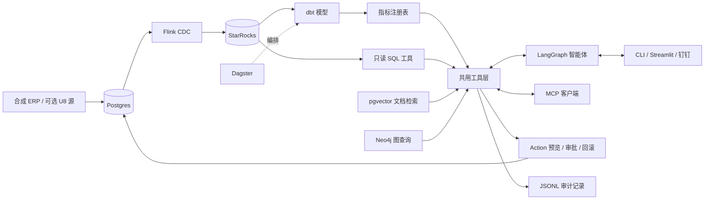

# DataSteward（数据管家）

[English](README.md) | **中文**

**可自托管的数据平台，探索 AI 智能体如何在治理约束下访问制造业数据。**

[](LICENSE)
[](https://github.com/Leonxu6/datasteward/actions/workflows/ci.yml)
[](pyproject.toml)

DataSteward 通过共用工具层，把 ERP 数据管道接入 LangGraph 智能体。项目关注一个具体的工程问题：**智能体怎样查询业务数据、留下可追查的访问记录，并提出可审核、可撤销的业务变更？**

仓库整合了 Postgres → Flink CDC → StarRocks、dbt 模型、指标注册表、访问策略、审计记录和源系统写回。虚构的中文制造业数据集让开发者无需客户数据即可查看整个流程。这是面向本地开发与实验的参考实现；下文的「范围与信任边界」说明当前实现实际能保证什么。

## 产品流程

演示围绕制造业运营中的协作展开：仓管查询库存、采购提出安全库存调整、管理者审核变更。治理界面把底层数据、权限判定和会话记录放到一起，方便审核者追查答案或操作建议是如何产生的。

**演示路径：**询问库存 → 检查查询与权限判定 → 预览支持的业务操作 → 在演示工作流中审批 → 检查源数据变更与审计记录。这是一条基于合成数据的产品流程，不代表已有客户采用或商业收益。

## 工程重点

| 设计选择 | 解决的问题 | 代码入口 |
|---|---|---|
| LangGraph 与 MCP 共用工具实现 | 减少不同客户端重复实现工具逻辑带来的行为分歧 | [工具内核](src/dm/tools/)、[智能体适配](src/dm/agent/graph.py)、[MCP 适配](src/dm/connector/mcp_server.py) |
| 显式调用身份 | 将用户、角色、目的、会话、通道及仓库范围带入查询策略和审计记录 | [Principal](src/dm/tools/principal.py)、[策略引擎](src/dm/security/policy.py) |
| SQL 与指标访问控制 | 组合只读 SQL 校验、Markings、行策略与脱敏；指标按已定义口径编译 | [SQL 工具](src/dm/tools/data.py)、[指标注册表](src/dm/ontology/metrics.yaml) |
| 写入源系统，再同步数仓 | 业务变更保留在 Postgres，经 CDC 更新分析视图 | [Actions](src/dm/ontology/actions.py)、[CDC 生成](src/dm/pipeline/gen_flink_cdc_sql.py) |
| 确定性数据与分层测试 | 将本地契约检查、数据库集成和 LLM 评估分别验证 | [造数器](src/dm/warehouse/generate.py)、[测试](tests/)、[评估题集](src/dm/eval/eval_set.yaml) |

## 架构


```mermaid
flowchart LR
    ERP["合成 ERP / 可选 U8 源"] --> PG[(Postgres)]
    PG --> CDC["Flink CDC"] --> SR[(StarRocks)]
    SR --> DBT["dbt 模型"] --> MET["指标注册表"]
    SR --> SQL["只读 SQL 工具"]
    MET --> K["共用工具层"]
    SQL --> K
    RAG["pgvector 文档检索"] --> K
    KG["Neo4j 图查询"] --> K
    K <--> AGENT["LangGraph 智能体"]
    K <--> MCP["MCP 客户端"]
    AGENT <--> UI["CLI / Streamlit / 钉钉"]
    K --> ACT["Action 预览 / 审批 / 回滚"] --> PG
    K --> AUDIT["JSONL 审计记录"]
    DAG["Dagster"] -. 编排 .-> DBT
```

智能体的工具定义委托给 `dm.tools`，数据库凭据留在应用运行环境中。SQL 查询与指标有策略检查；文档和图谱工具共用身份及审计机制，但尚未实现同等粒度的文档级、实体级授权。

仓库还提供 Streamlit 数据目录、血缘、健康和会话回放界面，Dagster 调度与传感器，以及可选的 SQL Server/U8 和钉钉集成。[设计规范](docs/design/SPEC.md)说明了完整的分层结构。

## 运行演示

需要 Docker 与 Compose v2，并为多个数据库及处理服务预留资源。智能体问答需要支持工具调用的 OpenAI 兼容端点；数据管道本身不依赖 LLM。资源占用与首次下载时间取决于启用的服务及模型。

```bash
git clone https://github.com/Leonxu6/datasteward
cd datasteward
cp .env.example .env
# 在 .env 中配置端点、模型和 DM_LLM_API_KEY。
bash deploy/quickstart.sh
```

Windows 请使用 Git Bash 或 WSL。配置与可选服务见[配置说明](docs/operations/configuration.md)和[部署说明](docs/operations/deployment.md)。需要文档索引及图谱骨架时，运行 `bash deploy/quickstart.sh --with-docs`。Ollama 是可选的 Compose profile，端点设置见 `.env.example` 注释。

默认界面：Streamlit 为 `http://localhost:8501`，Dagster 为 `http://localhost:3070`。宿主端口可通过 `DM_PORT_*` 设置修改。

```bash
docker compose -f deploy/docker-compose.yml run --rm dm-cli \
  dm-agent "物料 M0001 现在总库存多少？"
```

初始数据中，物料 `M0001` 的总库存是 **12**。这是演示的预期结果，并非准确率基准；仍需核对模型实际返回。造数器使用 `SEED=42` 与固定的 `2026-06-25` 数据锚，生成 19 张业务表。

快速启动脚本可能在 CDC 提交或冒烟检查失败后继续执行。请查看输出，并单独运行 `bash deploy/smoke.sh`，再判断服务是否就绪。

## 沿一次请求理解系统

**1. 查看权限拒绝。** 完成初始化后，以仓管角色请求受财务 Marking 保护的列：

```bash
docker compose -f deploy/docker-compose.yml run --rm dm-cli python -c "
from dm.tools import Principal, run_sql
print(run_sql(Principal(user='demo', role='仓管'),
              'SELECT customer_id, credit_limit FROM customer LIMIT 3'))"
```

`run_sql` 在执行前检查查询。策略拒绝这次财务数据访问，并尝试将判定写入审计记录。可从[内核测试](tests/test_tools_kernel.py)和[策略边界测试](tests/test_security_policy_boundaries.py)理解具体行为。

**2. 查看调用记录。** 工具记录包含调用身份、参数、耗时及结果元数据；治理界面按 `session_id` 串联会话活动。

```bash
tail -3 data/logs/audit_log.jsonl
```

**3. 查看写回生命周期。** `execute_action` 默认生成待审批预览；`approve_action` 执行已记录的提案；`rollback_action` 根据记录的旧值撤销支持的变更。写入落在 Postgres，再经 CDC 到达 StarRocks。实现与契约见 [Actions](src/dm/ontology/actions.py)、[审批状态测试](tests/test_action_approval_state.py)和[整数校验测试](tests/test_action_integer_contract.py)。执行审批会修改本地演示数据。

## 验证方式

以下开发环境安装项与 CI 的单元测试任务一致：

```bash
python -m venv .venv
. .venv/bin/activate
python -m pip install -e '.[dev,rag,kg,agent]'
pytest -m "not integration and not stack" -q
python -m scripts.run_maintenance_audits
```

[CI 工作流](.github/workflows/ci.yml)还检查 dbt 解析与 Compose 配置。数据库测试使用 `stack` 标记，在服务不可达时跳过；`integration` 测试需要额外的外部依赖。跳过测试不代表集成通过。完整开发流程见 [CONTRIBUTING.md](CONTRIBUTING.md)。

服务启动并配置好模型后，可运行：

```bash
docker compose -f deploy/docker-compose.yml run --rm dm-cli dm-eval
```

评估器支持数值、集合、拒答和叙述题评分。数值题与运行中数仓的 SQL 真值比较；叙述题可使用 LLM 评委。结果依赖数据集、端点及模型配置；此处不作综合性能承诺。

## 范围与信任边界

- **身份由宿主应用提供。** `Principal` 校验字段，但不认证真实用户。MCP 从环境配置读取身份；实际部署需要可信的身份认证和角色分配边界。
- **审批是工作流，并非独立的人工身份认证。** Action API 向具备权限的调用方暴露 `approve` 参数。若要强制仅由人工审批，需要额外的可信边界；当前接口本身不提供这一保证。
- **审计使用本地 JSONL，部分路径尽力写入。** 某些已完成操作在持久化失败时返回 `audit_warning`。日志不是防篡改的合规账本，且并非所有审计失败都会告知调用方。
- **不同工具的授权覆盖范围不同。** SQL/指标策略并不意味着目录元数据、文档检索和图查询具有相同的访问过滤。接入敏感数据前需逐项检查。
- **这是单机参考栈。** 当前不构成高可用、独立安全认证或生产性能的证明。U8 使用带水位的批量抽取；可选仿真服务仅支持 x86。

后续可围绕这些明确边界继续完善：认证与审批分离、统一检索授权、可靠审计投递，以及各部署组合的集成验证。

## 文档

深度文档目前以中文为主：

- [设计研究](docs/design/)与[实现规范](docs/design/SPEC.md)：本体、Markings、血缘、Actions 和平台设计。
- [项目计划](docs/PLAN.md)：设计目标与验收标准；计划事项不等于版本已交付能力。
- [开发记录](docs/DEVLOG.md)：CDC、容器网络、模型工具调用及取消行为的实现笔记。
- [运维文档](docs/operations/)：配置、安全、连接器、部署与故障排查。
- [贡献指南](CONTRIBUTING.md)：开发环境、测试分层与数据契约。

部分设计文档研究了 Palantir Foundry 公开文档中的概念。DataSteward 为独立项目，无关联或背书；这些参考不代表功能对等。

## 许可

[Apache-2.0](LICENSE)。
